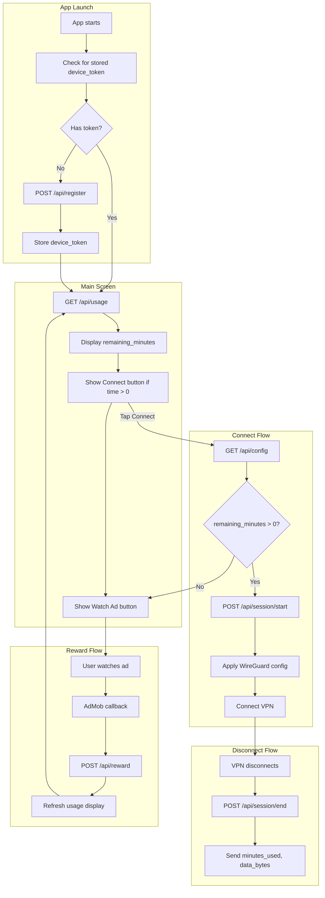

# Client Flow Blueprint

What the Android app (or any client) must do to work with the VPN Control API.

---

## 1. High-Level Flow



---

## 2. Client Responsibilities Checklist

### On First Launch

| Step | Action | API | Notes |
|------|--------|-----|------|
| 1 | Generate or read device ID | — | Use `Settings.Secure.ANDROID_ID` or UUID stored in EncryptedSharedPreferences |
| 2 | Register device | `POST /api/register` | Body: `{ "device_id": "<android_id_or_uuid>" }` |
| 3 | Store response | — | Save `device_token` securely (EncryptedSharedPreferences) |
| 4 | Fetch usage | `GET /api/usage` | Header: `Authorization: Bearer <device_token>` |

### On Every App Open

| Step | Action | API | Notes |
|------|--------|-----|------|
| 1 | Load stored `device_token` | — | If missing, go to First Launch flow |
| 2 | Fetch usage | `GET /api/usage` | Show remaining minutes, data used, remaining bandwidth |
| 3 | Enable/disable Connect | — | Enable only if `remaining_minutes > 0` and `remaining_bytes > 0` |
| 4 | Show Watch Ad button | — | Always visible for earning more time |

### When User Taps Connect

| Step | Action | API | Notes |
|------|--------|-----|------|
| 1 | Request config | `GET /api/config` | Header: `Authorization: Bearer <device_token>` |
| 2 | Check response | — | If 403, show "No time left" or "Daily data limit reached" and offer Watch Ad (adds time + 300MB) |
| 3 | Start session | `POST /api/session/start` | Call before applying VPN config |
| 4 | Apply WireGuard config | — | Use `config.config_string` from response |
| 5 | Connect VPN | — | Android VpnService + WireGuard library |

### When VPN Disconnects

| Step | Action | API | Notes |
|------|--------|-----|------|
| 1 | Calculate usage | — | Track session duration (minutes) and data (bytes) |
| 2 | End session | `POST /api/session/end` | Body: `{ "minutes_used": N, "data_bytes": N }` |
| 3 | Refresh UI | `GET /api/usage` | Update remaining time display |

**Server-side usage:** When the API runs on the same host as WireGuard, usage is verified server-side. Minutes come from `last_session_start` → now; data comes from WireGuard transfer stats. Client-reported values are used only when server stats are unavailable.

### When User Watches Rewarded Ad

| Step | Action | API | Notes |
|------|--------|-----|------|
| 1 | Show rewarded ad | — | AdMob RewardedAd or similar |
| 2 | On ad completed | — | AdMob `onUserEarnedReward` callback |
| 3 | Claim reward | `POST /api/reward` | Body: `{ "reward_type": "admob_rewarded", "ad_network": "admob" }` |
| 4 | Refresh usage | `GET /api/usage` | Show updated remaining_minutes |

---

## 3. API Reference Summary

| Endpoint | Method | Auth | Request | Response |
|----------|--------|------|---------|----------|
| `/api/register` | POST | No | `{ device_id: string }` | `{ device_token: string }` |
| `/api/usage` | GET | Bearer token | — | `{ remaining_minutes, minutes_used, data_bytes, daily_limit, rewards_today, remaining_bytes, daily_bandwidth_bytes, bytes_from_rewards_today }` |
| `/api/config` | GET | Bearer token | — | `{ remaining_minutes, servers, config: { config_string, ... } }` or 403 |
| `/api/session/start` | POST | Bearer token | — | `{ success: true }` |
| `/api/session/end` | POST | Bearer token | `{ minutes_used, data_bytes }` | `{ success: true }` |
| `/api/reward` | POST | Bearer token | `{ reward_type?, ad_network? }` | `{ minutes_added: 20, bytes_added: 314572800, success: true }` |
| `/api/servers` | GET | No | — | `{ servers: [{ id, name, region, host, port, endpoint }] }` |

---

## 4. Data to Track on Client

| Data | When to Set | Where to Store |
|------|-------------|----------------|
| `device_id` | First launch | EncryptedSharedPreferences |
| `device_token` | After register | EncryptedSharedPreferences |
| `session_start_time` | When VPN connects | In-memory |
| `session_data_bytes` | From VpnService or network stats | In-memory |

Session duration: `(now - session_start_time) / 60000` → minutes.

---

## 5. Error Handling

| Scenario | Client Action |
|----------|---------------|
| 401 Invalid token | Clear stored token, re-register |
| 403 No remaining minutes | Show "Watch ad" prompt, disable Connect |
| 403 Daily bandwidth limit reached | Show "Daily data limit reached. Try again tomorrow.", disable Connect |
| Config returns 403 | Same as above; user may have been revoked |
| Network error | Retry with backoff; show offline message |
| Session/end fails | Retry; optionally queue locally and sync later |

---

## 6. WireGuard Integration (Android)

1. Use `wireguard-android` or `tun2socks` + WireGuard library.
2. Parse `config_string` (INI format) or use the JSON fields:
   - `config.private_key`
   - `config.address`
   - `config.dns`
   - `config.server_public_key`
   - `config.endpoint`
3. Create `VpnService.Builder` and establish tunnel.
4. Route traffic through the tunnel.

---

## 7. Minimal User Journey

```
[User opens app]
    → App registers (if first time) or loads token
    → App fetches usage: "You have 30 minutes left"
    → User taps "Watch Ad" → earns 20 min → "You have 50 minutes left"
    → User taps "Connect" → app gets config → starts session → connects VPN
    → User browses for 15 minutes
    → User disconnects → app sends session/end (15 min, X bytes) → "You have 35 minutes left"
```

---

## 8. Order of Operations (Critical)

1. **Always** call `session/start` before connecting VPN.
2. **Always** call `session/end` when VPN disconnects (including app kill).
3. **Never** cache config across app restarts if usage may have changed; fetch fresh config before each connect.
4. **Never** store or log the WireGuard private key beyond what’s needed for the active session.
